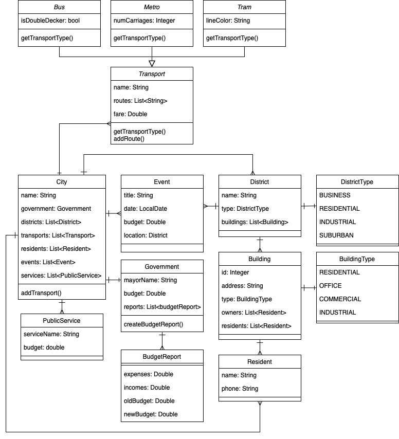

# Зміст
0.  [Як взагалі це все запустити](#як-взагалі-це-все-запустити)  
1.  [Опис предметної області](#опис-предметної-області)  
2.  [Основні завдання системи](#основні-завдання-системи)  
3.  [Додаткові структури](#додаткові-структури)  
4.  [Діаграма класів (UML)](#uml-діаграми)  

---


## Як взагалі це все запустити:
``` BASH
javac -d out src/supercity/*.java
mkdir out
java -cp out supercity.Main
```

---

## опис предметної області
- City — базовий клас, який зберігає інформацію про місто: назву, уряд (Government), списки районів (District), будівель (Building), мешканців (Resident), транспорт (Transport), подій (Event) та громадські послуги (PublicService
- District — район міста (може бути діловим, житловим, промисловим ітд). Містить список будівель
- Building — будівля (житлова, офісна, комерційна). Має власників, мешканців (для житлових) чи орендарів (офісних/комерційних
- Resident — людина, що живе у місті. Має свою особисту інформацію, може бути власником будівлі або просто мешканцем
- PublicService — система громадського обслуговування (водопостачання, енергетика, прибирання ітд
- Transport — громадський транспорт (автобус, метро, трамвай тощо). Держить в собі інформацію про розклад, маршрути, вартість проїзду
- Government — структура управління містом. Може створювати бюджетні звіти, контролювати послуги
- Event — подія в місті (культурна, спортивна, політична). проводиться у певному районі/будівлі

---

## основні завдання системи
1.	додавання, видалення, призначення власників, мешканців
2.	додавання видів транспорту, управління маршрутами, відображння розкладу
3.	призначення локації, дати, бюджету для подій
4.	створення, перегляд стану послуг, розподіл фінансів
5.	Правління (Government) формує звіти, розподіляє кошти між районами, послугами ітд

---

## додаткові структури
1.	BuildingType — : RESIDENTIAL, OFFICE, COMMERCIAL, INDUSTRIAL
2.	DistrictType — : BUSINESS, RESIDENTIAL, INDUSTRIAL, SUBURBAN
3.	BUS
4.  METRO
5.  TRAM

---

## uml діаграми
